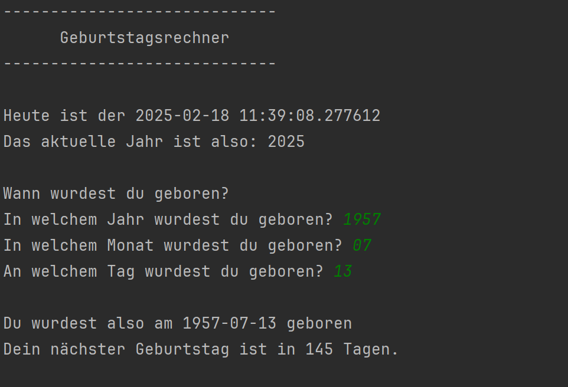
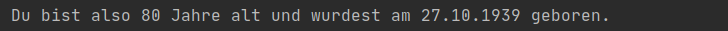

# Projekt 3: Geburtstag

Versucht, das abgebildete Programm selbst zu bauen. Der **weiße** Text ist die Ausgabe des Programms. Der **grüne** Text wird vom Benutzer eingegeben.

Diese drei Fälle sollten abgedeckt sein:
* Dein Geburtstag ist dieses Jahr schon vorbei
* Dein Geburtstag ist heute
* Dein Geburtstag kommt erst noch

Schreibe dein Programm in die Datei `program.py`

## Das könnte dir helfen:

**Funktionen**

    def meine_funktion(eingabe1, eingabe2):
        Zeile 1
        Zeile 2
        Zeile 3
        
        return WERT

**String-Formattierung**

Formatted Strings ("f-strings") für die Textausgabe mit Variablen:

`f("Ich bin {age} Jahre alt.")`

**Zahlen als Datum**

Das modul `datetime` stellt Methoden bereit, um mit Datumsobjekten zu arbeiten.

* `datetime.date(JAHR, MONAT, TAG)` generiert ein Datumsobjekt
*  `datetime.date.today()` liefert den aktuellen Tag
* Die Differenz zwischen zwei Daten bekommt man durch Subtraktion, das Ergebnis ist ein `timedelta` Objekt: `delta = DATUM1 - DATUM2`
* `delta.days` könnte hilfreich sein :)

## Bonusaufgabe:

Versuche auch folgende Details zu implementieren:

* Gib das aktuelle Alter in Jahren an
* Formatiere die Ausgabe des Datums mit `strftime()`, hilfreich dabei ist [strftime.org](https://strftime.org)

## Quelle

Die Übungsaufgaben basieren auf [cmacht/python-grundlagen](https://github.com/cmacht/python-grundlagen) und dem englischen Original von Michael Kennedy auf [TalkPython Training](https://training.talkpython.fm/courses/explore_python_jumpstart/python-language-jumpstart-building-10-apps).

